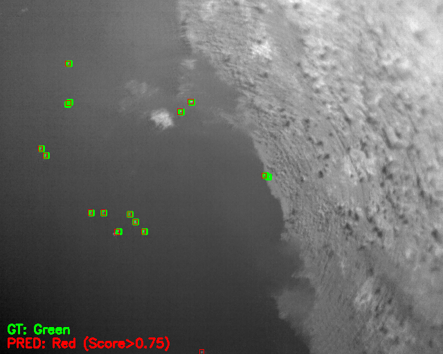
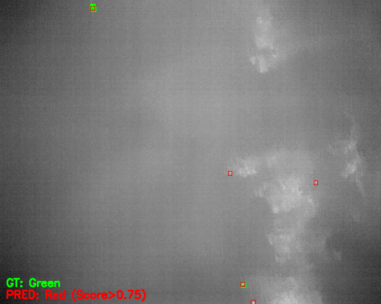
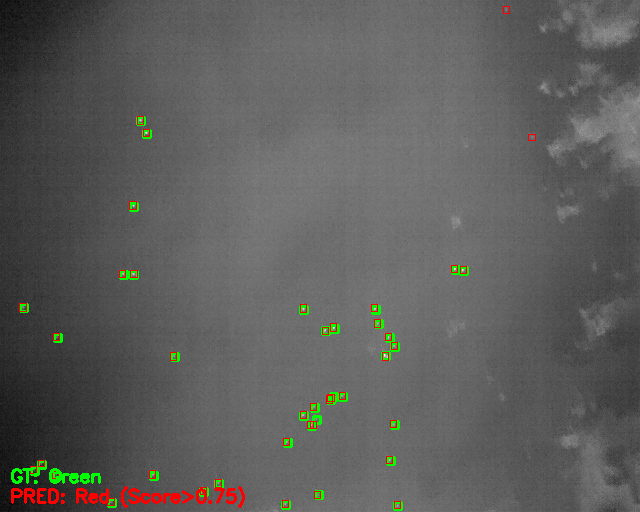
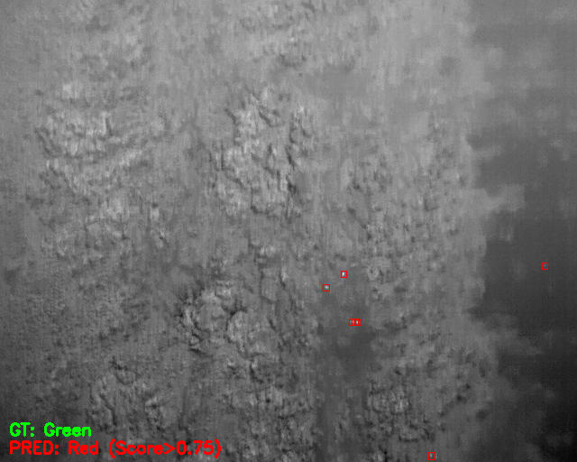
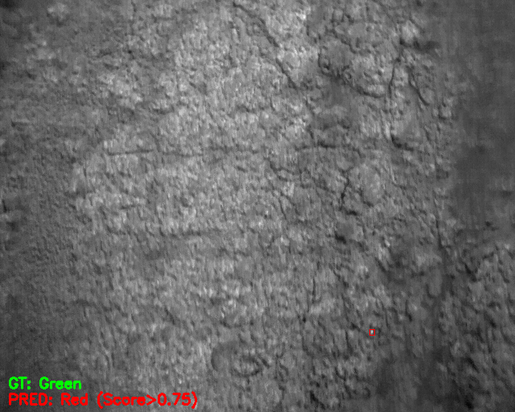
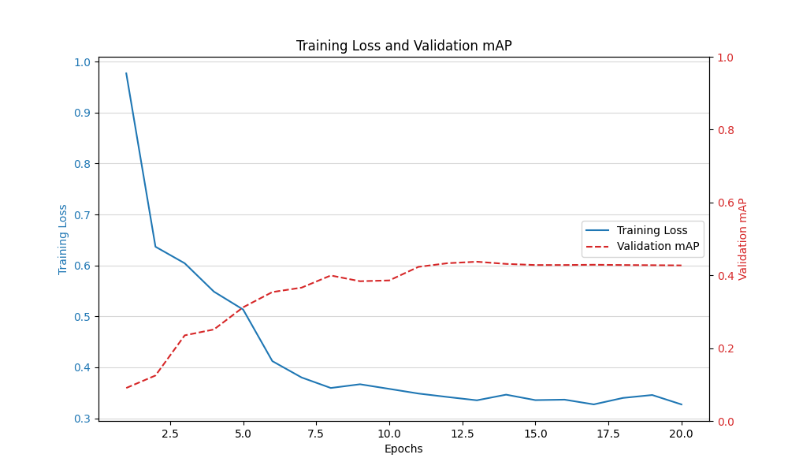
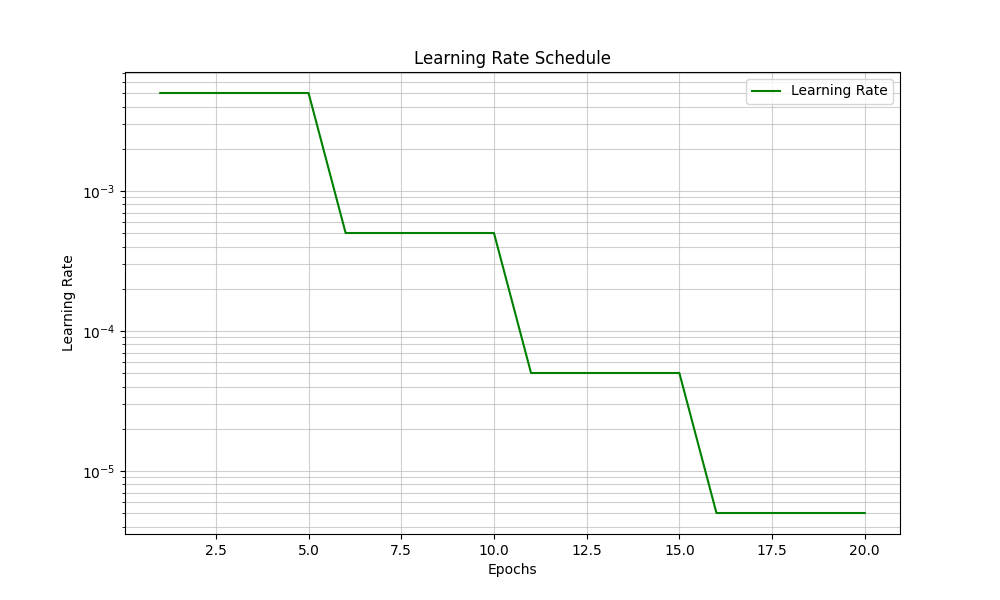

# Object Detection for Wildlife Conservation - Detecting Waterfowl in UAV Thermal Imagery

## 1. Data Preparation and Dataset Splitting

This section details the initial steps taken to process the raw thermal imagery dataset and prepare it for model training.

The data preparation is handled by the `prepare_data.py` script, which has two main steps: annotation parsing and dataset splitting.

### **1.1. Annotation Formatting (`data_utils/data_formatter.py`)**

The raw CSV annotations are parsed to create a unified, structured list of records.

* **Input:** Raw CSV label file and the thermal image directories (`positive_images/`, `negative_images/`).  
* **Process:**  
  * **Positive Images:** Annotations are converted from `(x, y, width, height)` format to the standard of `(xmin, ymin, xmax, ymax)`. All waterfowl are assigned `category_id: 1` and `category_name: 'waterfowl'`.  
  * **Negative Images:** Images without any waterfowl are included as records with an empty annotations list and `has_objects: False`.  
* **Output:** A `formatted_annotations.pkl` file which contains all image records, including positive and negative examples, saved to.

### **1.2. Dataset Splitting (`data_utils/data_splitter.py`)**

The complete dataset is split into non-overlapping Training, Validation, and Test subsets.

* **Strategy:** The splitting is performed on the image IDs.  
* **Split Ratios:**  
  * Training Set: 70% of total images.  
  * Validation Set: 15% of total images.  
  * Test Set: 15% of total images.  
* **Reproducibility:** A fixed `RANDOM_SEED = 42` is used to ensure the split is reproducible.  
* **Output:** Three text files containing the image IDs for each set, saved in the `split_dataset/` directory:  
  * `split_dataset/train_ids.txt`  
  * `split_dataset/val_ids.txt`  
  * `split_dataset/test_ids.txt`

### **1.3. Execution**

To run the data preparation pipeline, execute:

`python prepare_data.py`

This will generate the `formatted_annotations.pkl` file and the ID lists in the `split_dataset/` folder.

## **1.4. Data Augmentation and Normalization**

This section details the image preprocessing and data augmentation pipeline implemented in the `calculate_dataset_stats.py` and `data_augmentation.py` script.

### **1.4.1. Normalization Constant Calculation**

 The script `calculate_dataset_stats.py` first calculates the mean($\mu$) and standard deviation($\sigma$) on the training subset.

* **Calculated Normalization Constants:**  
  * Mean ($\mu$): **0.4112**  
  * Standard Deviation ($\sigma$): **0.1479**  
  * *These constants are used in the final normalization step of the image transformation pipeline.*

### **1.5. Data Augmentation Pipeline**

The `get_transform(train=true)` function defines a pipeline using the albumentations library, applying various transformations to both the image and the corresponding bounding boxes.

| Transformation | Type | Details |
| :---- | :---- | :---- |
| **A.Affine** | Geometric | $p=0.7$, scale=$(0.8, 1.2)$, rotate=$(\pm 10^\circ)$ |
| **A.RandomResizedCrop** | Geometric | $p=0.5$, size=($640 X 640$) | 
| **A.HorizontalFlip** | Geometric | $p=0.5$ |
| **A.VerticalFlip** | Geometric | $p=0.2$ |
| **A.RandomBrightnessContrast** | Intensity | $p=0.5$, limit=$\pm 0.3$|
| **A.GaussNoise & Blur** | Noise | $p=0.3$ and $p=0.2$ respectively |
| **A.Normalize** | Normalization | $\mu=0.4112, \sigma=0.1479$ |

### **1.5.1 Validation/Test Data Transformation**

The `get_transform(train=False)` function applies only the deterministic transformations: **Resizing** to $640X640$, followed by the same **Normalization** and **Tensor Conversion** steps. No random augmentations are used in the evaluation pipeline.

### **1.5.2. Visualization of Augmentations**

The `data_aug_vis.py` script, which imports the defined transformations from `data_pipeline.py`, allows for visual verification of the augmentation process. It randomly selects an image from the training set and displays the original image alongside several examples of augmented outputs, ensuring that bounding boxes are correctly transformed and maintained.

## **2. Object Detection Model and Training Configuration**

The object detection task is implemented using a two-stage detection framework.

### **2.1. Model Selection and Architecture**

* **Model:** **Faster R-CNN**  
* **Backbone:** **ResNet50 with Feature Pyramid Network (FPN)**  
* **Pre-training:** The model uses weights pre-trained on the ImageNet dataset.  
* **Final Layer Modification:** The original classification head (`FastRCNNPredictor`) is replaced to accommodate our single target class plus the background class, resulting in **2 classes** in total.  
* **Custom Anchors:** The default anchor generator is modified to cover a wider range of sizes, specifically increasing the maximum size to **2048** pixels for outliers.

### **2.2 Hyper-parameters and Training Configuration**

The training pipeline is configured using the following core parameters defined in the configuration files:

| Parameter | Value | Description |
| :---- | :---- | :---- |
| **Device** | cuda (if available) / cpu | Utilizes GPU acceleration for training if a CUDA-enabled device is found. |
| **Batch Size** | 4 | Number of images processed per training step. |
| **Number of Epochs** | 10 | The total number of passes over the entire training dataset. |
| **Optimizer** | Stochastic Gradient Descent (SGD) | Used for gradient optimization. |
| **Base Learning Rate (LR)** | 0.005 | The initial learning rate. |
| **Momentum** | 0.9 | Helps accelerate SGD in the relevant direction and dampens oscillations. |
| **Weight Decay** | 0.0005 | $L_2$ regularization applied to weights to prevent overfitting. |
| **LR Scheduler** | StepLR | The learning rate is dropped by a factor of 0.1 (LR_GAMMA) every 5 epochs (LR_STEP_SIZE). |
| **Log Frequency** | 25 steps | Frequency for reporting training loss and performance statistics. |

## 2.3 Training Pipeline

The main training loop is implemented in the primary script:`train.py`, utilizing the configured model and data utilities to manage the training flow, evaluation, and storage of results.

### **2.3.1 Waterfowl Dataset and Data Loading**

The **WaterfowlDataset** class in `data_utils/dataset_class.py` handles the retrieval of image data and corresponding annotations:

* **Initialization:** It loads the full annotation metadata (`formatted_annotations.pkl`) and filters the records based on the supplied split IDs (train, val, or test).  
* **Item Retrieval:**  
  * Loads images.
  * Applies the appropriate data augmentations defined in the `data_augmentation.py`.

### **2.3.2 Training and Evaluation**

The training process is as follows:

1. **Model and Optimizer Setup:** The Faster R-CNN model is loaded and moved to the target device (cuda or cpu). An **SGD optimizer** and a **StepLR scheduler** are initialized with the parameters defined in Section 2.2.  
2. **Training Loop (train_one_epoch):**  
   * The model processes batches, calculates the loss dictionary ( loss_classifier, loss_box_reg, etc.), performs backpropagation, and updates the weights.  
   * Detailed loss metrics are logged at a frequency of **25 steps**.  
3. **Validation and Evaluation (get_validation_metrics):**  
   * After each epoch, the model is evaluated on the validation set.  
   * The primary evaluation metric is **Mean Average Precision (mAP)**, calculated using the `torchmetrics` library. This provides an objective measure of detection quality (both localization and classification accuracy).  
   * The function also calculates validation loss metrics for monitoring overfitting.  
4. **Checkpointing (save_checkpoint):**  
   * Checkpoints containing the model state, optimizer state, and training history are saved after every epoch.  
   * A separate `_best.pth` checkpoint is maintained, storing the model state that achieved the **highest validation mAP** to date, ensuring the best performing model is always preserved.

## 3. Model Evaluation and Analysis

The trained Faster R-CNN model was evaluated on the Test set (15% of the data) using standard object detection metrics, focusing on **Mean Average Precision** (mAP).

**Checkpoint Download:** [Best Model Checkpoint](https://cloud.thws.de/s/xzaiM4nAc4daa5m)

### **3.1. Evaluation Results**

The evaluation was performed using the best model checkpoint saved based on validation mAP.

| Metric | Value | IoU Range | Interpretation |
| :---- | :---- | :---- | :---- |
| **mAP (IoU=0.50:0.95)** | **0.451** | Averaged over $[0.50, 0.95]$ | The strictest measure, reflecting overall accuracy and precise localization. |
| **mAP@50 (IoU=0.50)** | **0.869** | At IoU $\ge 0.50$ | Measures good detection of object presence and approximate location. |
| **mAP@75 (IoU=0.75)** | **0.394** | At IoU $\ge 0.75$ | Measures highly accurate object localization. |
| **Max Recall (MAR@100)** | **0.520** | Maximum recall with 100 detections/image | The highest achievable recall (True Positive Rate). |

### **3.2. Intuitions on Model Performance**

#### **How well does model detect waterfowl?**

The model demonstrates strong capability in identifying the **presence and approximate location** of waterfowl, evidenced by the high **mAP@50 score of 0.869**. This score suggests that when the model reports a bird, the bounding box overlaps the ground truth by at least 50% most of the time.

However, the significant performance drop from $\text{mAP}@50$ to the overall **mAP (0.451)** and **mAP@75 (0.394)** indicates a weakness in **precise localization**. The model struggles to place the bounding box accurately at strict IoU thresholds.The **Max Recall (0.520)** confirms that even with relaxed scoring, the model only successfully finds about half of all the waterfowl present in the test set, indicating that many small or faint thermal targets are being missed (False Negatives).

### **3.3. Strengths and Weaknesses of Thermal Imagery**

| Aspect | Discussion |
| :---- | :---- |
| **Strengths of Thermal Imagery** | **Detection against Camouflage:** Thermal signatures are highly effective for wildlife detection as they isolate the animal's heat signature from the background (water, vegetation), overcoming challenges like camouflage in RGB images.**Night/Low Light Operation:** Thermal cameras operate independently of visible light, enabling continuous monitoring across all times of day and night. |
| **Weaknesses of Thermal Imagery** | **Lack of Textural Detail:** Thermal images lack the fine texture and visual context of RGB, making species differentiation or individual identification difficult. **Environmental Interference:** Reflections on water, objects heated by the sun, or localized hot spots can generate false positives (False Detections) or interfere with the true thermal signature. |

## 3.4. Visualization and Error Analysis

The error analysis pipeline(`vis_and_err_analysis/error_analysis.py`) identifies and samples images representing three key detection outcomes: True Positives (TP), False Negatives (FN), and False Positives (FP).

### 3.4.1 Methodology

  * **Categorization:** Images are categorized based on: $\text{IoU} \ge 0.50$ and $\text{Confidence} \ge 0.75$. 
  * **True Positive (TP) Case:** Images where the number of correctly detected objects (TPs) is $80\%$ or more of the total ground truth count.  
  * **False Negative (FN) Case:** Images where the number of missed ground truth objects (FNs) is $80\%$  or more of the total ground truth count.  
  * **False Positive (FP) Case:** Images where the number of incorrect predictions (FPs) is $80\%$ or more of the total predictions made.  
* **Visualization:**  
  * **Ground Truth (GT):** Green Bounding Boxes  
  * **Prediction (PRED):** Red Bounding Boxes (confidence score $\ge 0.75$)

### 3.4.2 Sample Visualizations

#### **A.True Positives - TP**

Thiese image represents the model's general performance, where most waterfowl are successfully identified. The model predictions (Red boxes) align well with the ground truth (Green boxes), demonstrating good overall object localization. The high $\text{mAP}@50$ (0.869) seen in the evaluation results is supported by these cases.

#### **B. (False Negatives - FN)**

In this image, the model missed most of the ground truth waterfowl (Green boxes). Only two objects: in the bottom left corner and top right corner were detected. The primary cause of FNs is likely the low contrast of distant or small thermal targets against the background.

#### **C. False Positives - FP**

These image shows multiple instances where the model predicted a waterfowls in an area that contains no ground truth. The area is dominated by high-thermal-signature textured regions.

## **4. Analysis of Training Dynamics**

The script `vis_and_err_analysis/plots.py` analyzes the training process using plots generated from the per-epoch training history, which provides insight into convergence and the effect of the learning rate schedule.

### **4.1. Training Loss and Validation mAP Curves**

The plot below shows the training loss (blue line, left axis) and the validation mAP (red dashed line, right axis) across 20 training epochs.

#### **Key Findings:**

* **Rapid Convergence:** The **Training Loss** drops steeply in the first few epochs (1-5) before stabilizing around epoch 10, indicating the model learns the primary features quickly.  
* **Validation Performance:** The **Validation mAP** increases rapidly up to epoch 7, reaching its maximum value and then becoming relatively flat for the remaining epochs.  
* **Optimal Stopping:** The training process effectively reaches convergence around epoch **10** or earlier, where further training yields minimal improvement in validation performance. The model does not appear to suffer from significant overfitting, as the training loss continues a slow decline while validation **mAP** remains stable.

### **4.2. Learning Rate Schedule**

The learning rate plot confirms the application of the StepLR scheduler, which is designed to help the model escape local minima and stabilize training after initial feature learning.

#### **Key Findings:**

* **Step Decay:** The learning rate starts at the defined **Base LR (0.005)** and is reduced by a factor of 0.1 at epochs **5, 10, and 15**.  
* **Impact on Training:** The stability in the Validation mAP curve after epoch 7 suggests that the initial learning rate was sufficient for major convergence, and the subsequent steps help fine-tune the weights without disrupting the model's performance.

